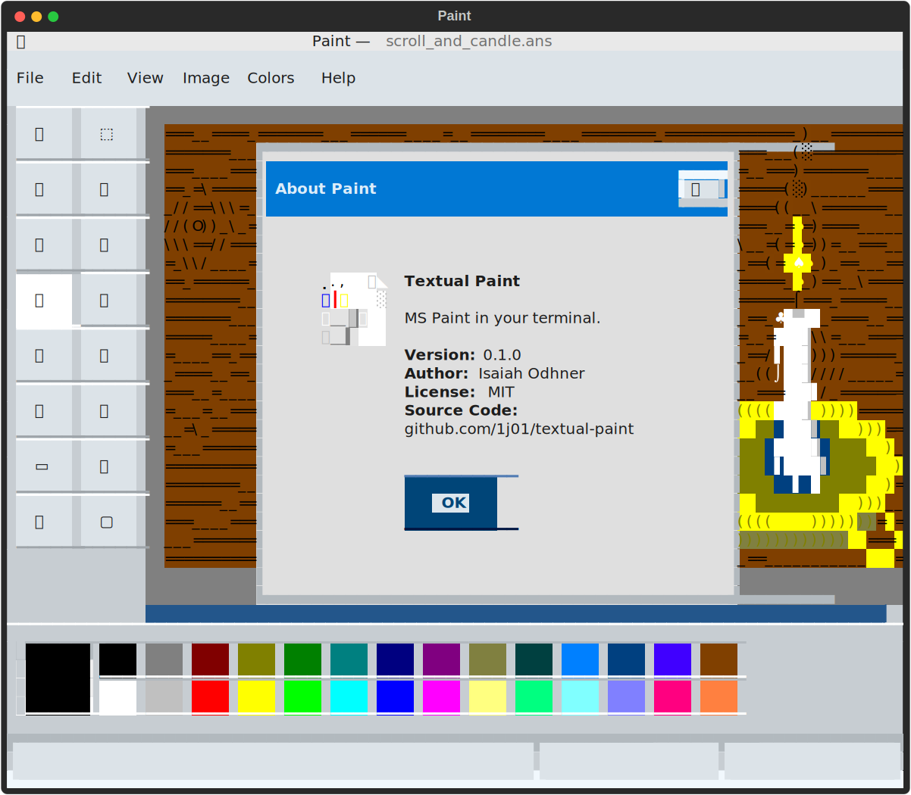

Textual Paint
=============

MS Paint in your terminal.

This is a TUI (Text User Interface) image editor, inspired by MS Paint, built with [Textual](https://textual.textualize.io/).

<!-- GitHub doesn't support line-height style in markdown, so I can't use inline HTML for the screenshot without seams between rows of text. But I can include the HTML inside <foreignObject> in an SVG file and include that as an  element. -->
<!-- GitHub doesn't support figure/figcaption in markdown, so I have to use a table. -->
<table>
<tr><td align="center">

</td></tr>
<tr><td align="center">This screenshot of Textual Paint is the terminal's screen buffer copied as HTML, wrapped in SVG, placed in HTML inside Markdown.<br>This might not render correctly in your browser.</tr></td>
</table>

## Features

- [x] Open and save images
  - [x] Fancy file dialogs
  - [x] Warnings when overwriting an existing file, or closing with unsaved changes
  - File formats:
    - [ ] PNG (.png)
    - [ ] Bitmap (.bmp)
    - [x] ANSI (.ans)
		  - Note that while it can load the files that it saves, you may have limited success loading other ANSI files that you find. ANSI files can vary a lot and even encode animations!
- Tools
    - [x] Free-Form Select
    - [x] Select
    - [x] Eraser/Color Eraser
    - [x] Fill With Color
    - [x] Pick Color
    - [x] Magnifier
    - [x] Pencil
    - [x] Brush
    - [x] Airbrush
    - [x] Text
    - [x] Line
    - [x] Curve
    - [x] Rectangle
    - [x] Polygon
    - [x] Ellipse
    - [x] Rounded Rectangle
- [x] Color palette
- [x] Undo/Redo
- [x] Efficient screen updates and undo/redo history, by tracking regions affected by each action
	- You could totally use this program over SSH! Haha, this "what if" project could actually be useful. Of course, it should be mentioned that you can also run graphical programs over SSH, but this might be more responsive, or just fit your vibe better.
- [x] Brush previews
- [x] Menu bar
- [x] Status bar
- [x] Keyboard shortcuts
- [x] Localization into 26 languages: Arabic, Czech, Danish, German, Greek, English, Spanish, Finnish, French, Hebrew, Hungarian, Italian, Japanese, Korean, Dutch, Norwegian, Polish, Portuguese, Brazilian Portuguese, Russian, Slovak, Slovenian, Swedish, Turkish, Chinese, Simplified Chinese

## Usage

<!-- ### Installation

```bash
pip install textual-paint
```

### Running

```bash
textual-paint
``` -->

### Command Line Options

```
$ python3 paint.py --help
usage: paint.py [-h] [--theme {light,dark}] [--language {ar,cs,da,de,el,en,es,fi,fr,he,hu,it,ja,ko,nl,no,pl,pt,pt-br,ru,sk,sl,sv,tr,zh,zh-simplified}] [--ascii-only-icons]
                [--inspect-layout] [--clear-screen] [--restart-on-changes]
                [filename]

Paint in the terminal.

positional arguments:
  filename              File to open

options:
  -h, --help            show this help message and exit
  --theme {light,dark}  Theme to use, either "light" or "dark"
  --language {ar,cs,da,de,el,en,es,fi,fr,he,hu,it,ja,ko,nl,no,pl,pt,pt-br,ru,sk,sl,sv,tr,zh,zh-simplified}
                        Language to use
  --ascii-only-icons    Use only ASCII characters for tool icons
  --inspect-layout      Inspect the layout with middle click, for development
  --clear-screen        Clear the screen before starting; useful for development, to avoid seeing fixed errors
  --restart-on-changes  Restart the app when the source code is changed, for development
```

### Keyboard Shortcuts

- <kbd>Ctrl</kbd>+<kbd>D</kbd>: Toggle Dark Mode
- <kbd>Ctrl</kbd>+<kbd>Q</kbd>: Quit
- <kbd>Ctrl</kbd>+<kbd>Shift</kbd>+<kbd>S</kbd>: Save As **IF SHIFT IS DETECTED** — might trigger Save instead, and overwrite the open file! ⚠️
- <kbd>Ctrl</kbd>+<kbd>Shift</kbd>+<kbd>Z</kbd>: Redo **IF SHIFT IS DETECTED** — might trigger Undo instead.

The rest match MS Paint's keyboard shortcuts:

- <kbd>Ctrl</kbd>+<kbd>S</kbd>: Save
- <kbd>Ctrl</kbd>+<kbd>O</kbd>: Open
- <kbd>Ctrl</kbd>+<kbd>N</kbd>: New
- <kbd>Ctrl</kbd>+<kbd>T</kbd>: Toggle Tools Box
- <kbd>Ctrl</kbd>+<kbd>W</kbd>: Toggle Colors Box
- <kbd>Ctrl</kbd>+<kbd>Z</kbd>: Undo
- <kbd>Ctrl</kbd>+<kbd>Y</kbd>: Redo
- <kbd>F4</kbd>: Redo
- <kbd>Ctrl</kbd>+<kbd>A</kbd>: Select All
- <kbd>Ctrl</kbd>+<kbd>PageUp</kbd>: Large Size
- <kbd>Ctrl</kbd>+<kbd>PageDown</kbd>: Normal Size

### Tips

You can draw with a character by clicking the selected color display area in the palette and then typing the character,
or by double clicking the same area to pick a character a list.

You can set the text color by holding Ctrl while clicking a color in the palette, or while double clicking a color to open the Edit Colors dialog.

You can display a saved ANSI file in the terminal with `cat`:

```bash
cat file.ans
```

## Known Issues

- The Text tool doesn't collapse a text selection when typing. Undo/Redo doesn't work with text. Ctrl+Z will delete the textbox.
- Selection box border is inside instead of outside (and lacks dashes). For the text box, I hid the border because it was too visually confusing, but it should also have an outer border.
- Pick Color can't be cancelled, since it samples the color continuously.
- Pressing both mouse buttons to cancel tools can sometimes result the the tool restarting, or it's just my mouse. It's probably my mouse, now that I think about it. But also, it should actually undo current action, not just end it.
- Help > Help Topics isn't very helpful.
- Due to limitations of the terminal, shortcuts using Shift or Alt might not work.
- Menus are not keyboard navigable.
- Clicking the Zoom submenu doesn't always work. You just have to click it a few times before it opens. (It may be technically open but positioned off screen, or lacking width/height. I don't know.)
- Some languages don't display correctly.
- Large files can make the program very slow, as can magnifying the canvas.
- The program sometimes crashes or freezes randomly, and there's no auto-save feature.
- Saved ANSI files are unnecessarily large, because they include escape sequences for every cell, even if the colors match the previous cell.
- Loading and saving a file without making any edits can change color values slightly, e.g. 128 → 127. The Color Eraser feature compensates for this with a slight tolerance, but the fill tool does not.

The program has only been tested on Linux. Issues on other platforms are as-yet _unknown_ :)

## Development

Install Textual and other dependencies:
```bash
pip install "textual[dev]" stransi psutil watchdog pyperclip pyright
```

Run via Textual's CLI for live-reloading CSS support, and enable other development features:
```bash
textual run --dev "paint.py --clear-screen --inspect-layout --restart-on-changes"
```

Or run more basically:
```bash
python paint.py
```

`--clear-screen` is useful for development, because it's sometimes jarring to see error messages that have actually been fixed, when exiting the program.

`--inspect-layout` lets you middle click to visualize the layout breakdown by labeling each widget in the hierarchy, and coloring their regions. The labels affect the layout, so you can also hold Ctrl to only colorize, and you can remember how the colors correspond to the labels.

`--restart-on-changes` automatically restarts the program when any Python files change. This works by the program restarting itself directly. (Programs like `modd` or `nodemon` that run your program in a subprocess don't work well with Textual's escape sequences.)

There are also launch tasks configured for VS Code, so you can run the program from the Run and Debug panel.
Note that it runs slower in VS Code's debugger.

To see logs, run [`textual console`](https://textual.textualize.io/guide/devtools/#console) and then run the program via `textual run --dev`.
This also makes it run slower.

### Update Dependencies

```bash
python -m pipreqs.pipreqs --ignore .history --force
```


## License

[MIT](LICENSE.txt)


## Unicode Symbols and Emojis for Paint Tools

The first thing I did in this project was to collect possible characters to represent all the tool icons in MS Paint, to gauge how good of a recreation it would be possible to achieve, starting from looks.
Unfortunately, I haven't run into any significant roadblocks, so I'm apparently recreating MS Paint. [Again.](https://jspaint.app)

These are the symbols I've found so far:

- Free-Form Select:  ✂️📐🆓🕸✨⚝🫥🇫/🇸◌⁛⁘ ⢼⠮
- Select: ⬚▧🔲 ⣏⣹
- Eraser/Color Eraser: 🧼🧽🧹🚫👋🗑️▰▱
- Fill With Color: 🌊💦💧🌈🎉🎊🪣🫗
- Pick Color: 🎨💉💅💧📌📍⤤𝀃🝯🍶
- Magnifier: 🔍🔎👀🔬🔭🧐🕵️‍♂️🕵️‍♀️
- Pencil: ✏️✎✍️🖎🖊️🖋️✒️🖆📝🖍️
- Brush: 🖌️🖌👨‍🎨🧑‍🎨💅
- Airbrush: 💨ᖜ╔🧴🥤🫠
- Text: 🆎📝📄📃🔤📜AＡ
- Line: 📏📉📈⟍𝈏╲⧹\⧵∖
- Curve: ↪️🪝🌙〰️◡◠~∼≈∽∿〜〰﹋﹏≈≋～⁓
- Rectangle: ▭▬▮▯🟥🟧🟨🟩🟦🟪🟫⬛⬜◼️◻️◾◽▪️▫️
- Polygon: ▙𝗟𝙇﹄』⬣⬟🔶🔷🔸🔹🔺🔻△▲
- Ellipse: ⬭⭕🔴🟠🟡🟢🔵🟣🟤⚫⚪🫧
- Rounded Rectangle: ▢⬜⬛

The default symbols used may not be the best on your particular system, so I may add some kind of configuration for this in the future.

### Cursor

A crosshair cursor could use one of `+✜✛✚╋╬`, but whilst that imitates the look, it might be better to show the pixel under the cursor, i.e. character cell, surrounded by dashes, like this:

```
 ╻
╺█╸
 ╹
```

## See Also

- [JavE](http://jave.de/), an advanced Java-based ASCII art editor
- [Playscii](http://vectorpoem.com/playscii/), a beautiful ASCII/ANSI art editor. This is also written in Python and MIT licensed, so I might take some code from it, for converting images to ANSI, for example. Maybe even try to support (or piggy back off of) its file format.
- [cmdpxl](https://github.com/knosmos/cmdpxl), a pixel art editor for the terminal using the keyboard
- [pypixelart](https://github.com/douglascdev/pypixelart), a pixel art editor using vim-like keybindings, inspired by cmdpxl but not terminal-based
