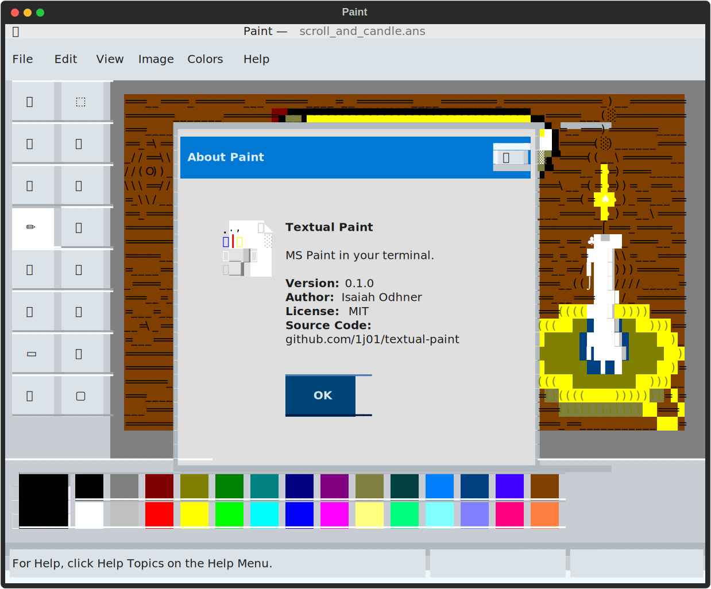

Textual Paint
=============

MS Paint in your terminal.

This is a TUI (Text User Interface) image editor, inspired by MS Paint, built with [Textual](https://textual.textualize.io/).

<!-- GitHub doesn't support line-height style in markdown, so I can't use inline HTML for the screenshot without seams between rows of text. But I can include the HTML inside <foreignObject> in an SVG file and include that as an  element. -->
<!-- GitHub doesn't support figure/figcaption in markdown, so I have to use a table. -->
<table>
<tr><td align="center">

</td></tr>
<tr><td align="center">This screenshot of Textual Paint is the terminal's screen buffer copied as HTML, wrapped in SVG, placed in HTML inside Markdown.<br>This might not render correctly in your browser.</tr></td>
</table>

## Features

- Open and save images
	- [ ] PNG (.png)
	- [ ] Bitmap (.bmp)
	- [x] ANSI (.ans)
		- only supports loading files saved by this program; ANSI files can vary a lot and even encode animations
- Tools
    - [ ] Free-Form Select
    - [ ] Rectangular Select
    - [x] Eraser
        - [ ] Color Eraser
    - [x] Fill With Color
    - [x] Pick Color
    - [ ] Magnifier
    - [x] Pencil
    - [x] Brush
    - [x] Airbrush
    - [ ] Text
    - [x] Line
    - [ ] Curve
    - [x] Rectangle
    - [ ] Polygon
    - [x] Ellipse
    - [x] Rounded Rectangle
- [x] Color palette
- [x] Undo/Redo
- [x] Efficient screen updates and undo/redo history, by tracking regions affected by each action
	- You could totally use this program over SSH! Haha, this "what if" project could actually be useful. Of course, it should be mentioned that you can also run graphical programs over SSH, but this might be more responsive, or just fit your vibe better.
- [x] Brush previews
- [x] Menu bar

## Usage

<!-- ### Installation

```bash
pip install textual-paint
```

### Running

```bash
textual-paint
``` -->

### Command Line Options

```
$ python3 paint.py --help
usage: paint.py [-h] [--theme THEME] [--ascii-only-icons] [--clear-screen] [filename]

Paint in the terminal.

positional arguments:
  filename            File to open

options:
  -h, --help          show this help message and exit
  --theme THEME       Theme to use, either "light" or "dark"
  --ascii-only-icons  Use only ASCII characters for tool icons
  --clear-screen      Clear the screen before starting; useful for development, to avoid seeing fixed errors
```

### Keyboard Shortcuts

- <kbd>Ctrl</kbd>+<kbd>D</kbd>: Toggle Dark Mode
- <kbd>Ctrl</kbd>+<kbd>Q</kbd>: Quit
- <kbd>Ctrl</kbd>+<kbd>Shift</kbd>+<kbd>S</kbd>: Save As **IF SHIFT IS DETECTED** — might trigger Save instead, and overwrite the open file! ⚠️
- <kbd>Ctrl</kbd>+<kbd>Shift</kbd>+<kbd>Z</kbd>: Redo **IF SHIFT IS DETECTED** — might trigger Undo instead.

The rest match MS Paint's keyboard shortcuts:

- <kbd>Ctrl</kbd>+<kbd>S</kbd>: Save
- <kbd>Ctrl</kbd>+<kbd>O</kbd>: Open
- <kbd>Ctrl</kbd>+<kbd>N</kbd>: New
- <kbd>Ctrl</kbd>+<kbd>T</kbd>: Toggle Tools Box
- <kbd>Ctrl</kbd>+<kbd>W</kbd>: Toggle Colors Box
- <kbd>Ctrl</kbd>+<kbd>Z</kbd>: Undo
- <kbd>Ctrl</kbd>+<kbd>Y</kbd>: Redo
- <kbd>F4</kbd>: Redo

## Development

Install Textual and Stransi:
```bash
pip install "textual[dev]" "stransi"
```

Run via Textual's CLI for live-reloading CSS support:
```bash
textual run --dev "paint.py --clear-screen"
```

Or run more basically:
```bash
python paint.py --clear-screen
```

`--clear-screen` is useful for development, because it's sometimes jarring to see error messages that have actually been fixed, when exiting the program.

There are also launch tasks configured for VS Code, so you can run the program from the Run and Debug panel.

I tried running via `modd` to automatically reload the program when (non-CSS) files change, but it doesn't handle ANSI escape sequences well. I wonder if it would work better now with the `--clear-screen` option. (I could also look for another tool that's more part of the Python ecosystem.)

## License

[MIT](LICENSE.txt)


## Unicode Symbols and Emojis for Paint Tools

The first thing I did in this project was to collect possible characters to represent all the tool icons in MS Paint, to gauge how good of a recreation it would be possible to achieve, starting from looks.
Unfortunately, I haven't run into any significant roadblocks, so I'm apparently recreating MS Paint. [Again.](https://jspaint.app)

These are the symbols I've found so far:

- Free-Form Select:  ✂️📐🆓🕸✨⚝🫥🇫/🇸◌⁛⁘ ⢼⠮
- Rectangular Select: ⬚▧🔲 ⣏⣹
- Eraser/Color Eraser: 🧼🧽🧹🚫👋🗑️
- Fill With Color: 🌊💦💧🌈🎉🎊🪣🫗
- Pick Color: 🎨💉💅💧📌📍⤤𝀃🝯🍶
- Magnifier: 🔍🔎👀🔬🔭🧐🕵️‍♂️🕵️‍♀️
- Pencil: ✏️✎✍️🖎🖊️🖋️✒️🖆📝🖍️
- Brush: 🖌️🖌👨‍🎨🧑‍🎨💅
- Airbrush: 💨ᖜ╔🧴🥤🫠
- Text: 🆎📝📄📃🔤📜AＡ
- Line: 📏📉📈⟍𝈏╲⧹\⧵∖
- Curve: ↪️🪝🌙〰️◡◠~∼≈∽∿〜〰﹋﹏≈≋～⁓
- Rectangle: ▭▬▮▯🟥🟧🟨🟩🟦🟪🟫⬛⬜◼️◻️◾◽▪️▫️
- Polygon: ▙𝗟𝙇﹄』⬣⬟🔶🔷🔸🔹🔺🔻△▲
- Ellipse: ⬭⭕🔴🟠🟡🟢🔵🟣🟤⚫⚪🫧
- Rounded Rectangle: ▢⬜⬛

The default symbols used may not be the best on your particular system, so I may add some kind of configuration for this in the future.

### Cursor

A crosshair cursor could use one of `+✜✛✚╋╬`, but whilst that imitates the look, it might be better to show the pixel under the cursor, i.e. character cell, surrounded by dashes, like this:

```
 ╻
╺█╸
 ╹
```

## See Also

- [JavE](http://jave.de/), an advanced Java-based ASCII art editor
- [Playscii](http://vectorpoem.com/playscii/), a beautiful ASCII/ANSI art editor
- [cmdpxl](https://github.com/knosmos/cmdpxl), a pixel art editor for the terminal using the keyboard
- [pypixelart](https://github.com/douglascdev/pypixelart), a pixel art editor using vim-like keybindings, inspired by cmdpxl but not terminal-based
